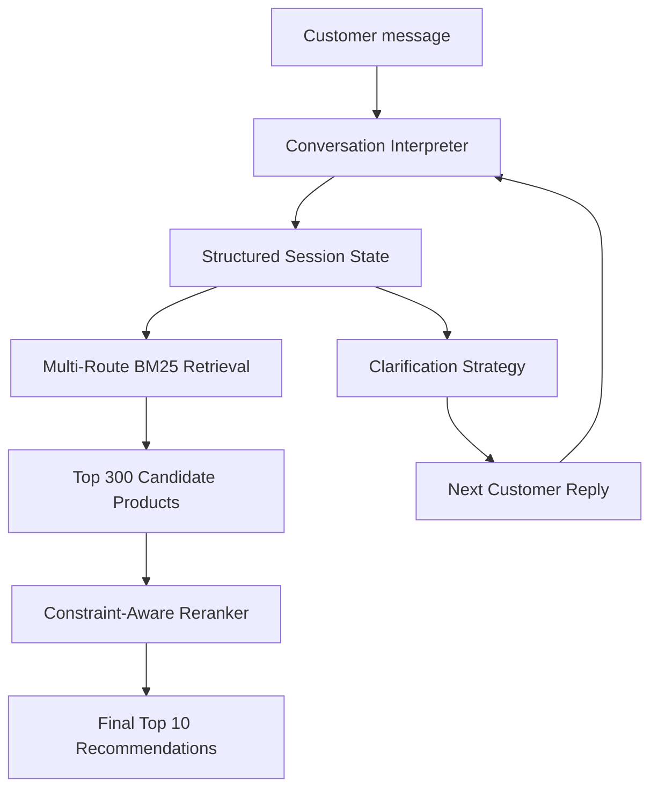

# Conversational Product Search — Initial Architecture

This repository contains our first working architecture for the TechJam Conversational E-Commerce Search Challenge.

The agent searches a frozen catalog of 50,000 products and has up to 10 conversational turns to place the customer's hidden target product in its Top 10 recommendations. The current implementation is fully offline, uses no LLM, and reports zero token usage.

## High-Level Flow



Each conversation turn performs two related actions:

1. Return the strongest product recommendations currently available.
2. Ask one useful, non-repeating clarification question when more information is needed.

## 1. Conversation Interpretation

The customer message is converted from free-form text into structured preferences.

For example:

```text
"I need black leather walking shoes"
```

becomes approximately:

```python
[
    Constraint(attribute="color", value="black", strength="hard"),
    Constraint(attribute="material", value="leather", strength="hard"),
    Constraint(attribute="use_case", value="walking", strength="hard"),
]
```

The interpreter also handles:

- Buying versus Browsing intent
- Incremental preference accumulation
- Hard requirements versus soft preferences
- Explicit intent overrides
- Attributes for which the customer has no preference

## 2. Structured Session State

Every session has independent memory containing:

- Product category
- Active constraints
- Overridden constraints
- Buying or Browsing route
- Previously asked attributes
- Unrestricted attributes
- Lightweight user-profile context

When a customer changes their mind, the old preference is marked as overridden and stops affecting retrieval and ranking.

## 3. Multi-Route Retrieval

The full catalog is loaded into an in-memory SQLite FTS5 index. Several field-weighted BM25 searches run on every turn:

- Accumulated category and active constraints
- Product category
- Newly disclosed information
- Individual recent constraints
- Low-weight profile preferences

The routes are combined with reciprocal-rank fusion. This first stage is recall-oriented and keeps up to 300 potentially relevant products.

## 4. Constraint-Aware Reranking

The second stage inspects the candidate products rather than immediately trusting their BM25 order.

Each candidate receives a new score based on:

- First-stage retrieval strength
- Category compatibility
- Exact requirement phrase matches
- Requirement token coverage
- Matches in attribute-relevant fields
- Hard versus soft constraint strength
- Penalties for failing hard constraints

The reranker sorts the candidate pool using this compatibility score and returns the final Top 10.

## 5. Clarification Strategy

The agent asks about one unanswered attribute at a time while still returning recommendations on every turn.

Current clarification priority:

```text
material → feature → color → style → size → use case → budget → brand → other
```

Answered, previously asked, and unrestricted attributes are skipped.

## Code Layout

```text
starter/
├── agent.py          # Evaluator entry point and pipeline orchestration
├── conversation.py   # Message interpretation and state updates
├── models.py         # Constraints, sessions, products, and candidates
├── retrieval.py      # SQLite FTS5 index and BM25 candidate retrieval
├── ranking.py        # Constraint-aware second-stage reranking
├── text.py           # Text normalization and token helpers
└── README.md         # Compact module reference
```

## Current Public Evaluation

Results on the 200-session public development set:

| Metric | Weak starter | Current architecture |
|---|---:|---:|
| Hit Rate@10 | 0.125 | **0.930** |
| MRR | 0.068 | **0.620** |
| MTTC | 9.81 | **3.905** |
| Technical score | 0.107 | **0.793** |
| Token usage | 0 | **0** |

Scenario Hit Rate@10:

| Scenario | Hit Rate@10 |
|---|---:|
| Buying | 0.938 |
| Browsing | 0.988 |
| Intent Override | 0.767 |
| Boundary | 0.900 |

These are public-set development results and may not exactly represent private-set performance.

## Running the Agent

Python 3.10 or later is recommended. Place the downloaded catalog at `data/catalog.jsonl`, then run:

```bash
python3 -m evaluator.local_evaluator --output results.json
```

Run the tests with:

```bash
python3 -m unittest discover -v
```

## Current Limitations

- Constraint extraction currently uses deterministic rules.
- Clarification order is fixed rather than candidate-aware.
- The system does not yet include vector or semantic retrieval.
- Reranking weights are heuristic and should be validated with ablation tests.
- Intent Override remains the weakest public scenario.

## Likely Next Steps

1. Add candidate-recall diagnostics for the remaining misses.
2. Inspect retrieval failures separately from reranking failures.
3. Make clarification selection candidate-aware.
4. Test dense retrieval only if BM25 candidate recall is insufficient.
5. Continue preserving the deterministic offline path as the default fallback.
